# YuliyaDM    

 
 
 

**Hello, guys! 🖐**

_I am Julia Pirogova, student, who loves **frontend** and have a couple of projects._

## What techonologies do I know? 🍰

### Main ☕

* ``HTML/CSS/JS`` 
* ``Canvas``
* ``React``
* ``Git``
* ``Node.js``

### Libraries 🍫

| Libraries |
| --- |         
| `confetti.js` |    
| `scroll-reveal.js` |
| `tiny-slider.js` | 
| `atropos.js` |
| `parallax.js` |

### Frameworks 🥦

| Frameworks |
| --- |
| `SCSS` |
| `Stylus` |
| `TypeScript` |

***

## Github 🖥

  

  ###

  
  
  ###
  
  

  ###

  

## Statictics

  
  

## Diff history

  

## Other information 

> Also learning __*some new language*__ 👀

---

## Social networks 📱

   

  
  
  ###
  
  

  
  
  ###
  
  

  

