# 
YuliyaDM   

  

## 
What techonologies do I know?

### Main

* ``HTML/CSS/JS``
* ``Canvas``
* ``React``
* ``Git``
* ``Node.js``
* ``TypeScript``
* ``Telegram bots``

### Frameworks  

| Frameworks |
| --- |
| `SCSS` |
| `React` |

## 
Github
    

 

    
  
   
 
   

 

## 
Statictics

 

  
  

 

## 
Social networks
 

 

   
  
  

  
  
  

 

`08.19.2023` 

<strong>I have stopped coding since Frebruary.</strong>

Currently I am going to work with 3d printing. Probably, I will share with you some models which seems to me pretty nice artworks.
